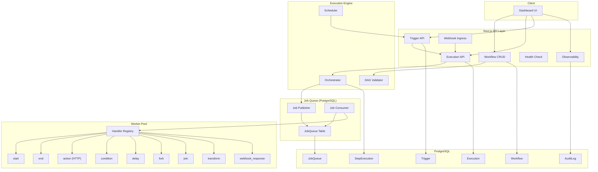

<div align="center">

# ⚡ FlowSync

**Durable workflow orchestration engine with event-driven execution and distributed workers.**

Built with Next.js · PostgreSQL · Prisma · Clerk Auth

</div>

---

## Architecture



---

## Features

| Category | Feature | Description |
|---|---|---|
| **Workflow Modeling** | DAG Definition | JSON-based directed acyclic graph definitions |
| | Visual Editor | Drag-and-drop workflow builder (ReactFlow) |
| | DAG Validation | Cycle detection, reachability analysis |
| | Versioning | Automatic version bumps on definition changes |
| **Execution** | Sequential Orchestration | Deterministic DAG traversal with state persistence |
| | Parallel Execution | Fork/join nodes for concurrent branches |
| | Conditional Branching | if/else routing based on previous step results |
| | Cancel Support | Graceful execution cancellation |
| **Triggers** | Manual | API-driven execution start |
| | Webhook | HTTP endpoint per trigger for external events |
| | Cron | Scheduled execution via cron expressions |
| **Reliability** | Retry Policy | Exponential backoff with configurable limits |
| | Idempotency | Deduplication keys prevent duplicate step execution |
| | Dead-Letter Queue | Captures permanently failed jobs for inspection |
| | Persistent Queue | PostgreSQL-backed queue with `SELECT FOR UPDATE SKIP LOCKED` |
| | Backpressure | Automatic queue throttling when depth exceeds limits |
| | Worker Heartbeat | Stall detection for unresponsive workers |
| **Observability** | Structured Logging | Categorized log levels with context |
| | Metrics | Execution counts, latency, queue throughput |
| | Audit Trail | Persistent event log for all system actions |
| | Execution Timeline | Step-by-step timing visualization |
| **Security** | Authentication | Clerk-based user auth with middleware |
| | User Isolation | Workflows/executions scoped to authenticated user |
| | Rate Limiting | Per-IP request throttling |

---

## Node Types

| Type | Handler | Description |
|---|---|---|
| `start` | `StartHandler` | Entry point — every workflow begins here |
| `end` | `EndHandler` | Terminal node — marks execution complete |
| `action` | `ActionNodeHandler` | HTTP request (GET/POST/PUT/DELETE) to external APIs |
| `condition` | `ConditionHandler` | Evaluates expressions against previous step results for branching |
| `delay` | `DelayHandler` | Pauses execution for a configurable duration |
| `fork` | `ForkHandler` | Splits execution into parallel branches |
| `join` | `JoinHandler` | Waits for all parallel branches to complete before continuing |
| `transform` | `TransformHandler` | JSON field mapping, key renaming, and template strings |
| `webhook_response` | `WebhookResponseHandler` | Formats response data from previous step results |

---

## API Routes

| Method | Route | Description |
|---|---|---|
| `GET` | `/api/workflows` | List all workflows |
| `POST` | `/api/workflows` | Create a new workflow |
| `GET` | `/api/workflows/:id` | Get workflow details |
| `PUT` | `/api/workflows/:id` | Update workflow (auto-bumps version) |
| `DELETE` | `/api/workflows/:id` | Delete a workflow |
| `GET` | `/api/executions` | List all executions |
| `POST` | `/api/executions` | Start a new execution |
| `GET` | `/api/executions/:id` | Get execution details with steps |
| `POST` | `/api/executions/:id/cancel` | Cancel a running execution |
| `GET` | `/api/executions/:id/timeline` | Get execution timeline data |
| `GET` | `/api/triggers` | List all triggers |
| `POST` | `/api/triggers` | Create a trigger |
| `GET` | `/api/triggers/:id` | Get trigger details |
| `PUT` | `/api/triggers/:id` | Update trigger config |
| `DELETE` | `/api/triggers/:id` | Delete a trigger |
| `POST` | `/api/webhooks/:triggerId` | Webhook ingress endpoint |
| `GET` | `/api/queue` | Queue monitoring stats |
| `GET` | `/api/health` | System health / readiness probe |
| `GET` | `/api/scheduler/status` | Scheduler status |
| `GET` | `/api/observability/metrics` | System metrics snapshot |
| `GET` | `/api/observability/audit` | Query audit log |

---

## Tech Stack

| Layer | Technology |
|---|---|
| Framework | Next.js 16 (App Router) |
| Language | TypeScript |
| Database | PostgreSQL |
| ORM | Prisma 7 |
| Auth | Clerk |
| Visual Editor | @xyflow/react |
| Validation | Zod |
| Icons | Lucide React |
| Notifications | Sonner |

---

## Getting Started

### Prerequisites

- Node.js 18+
- PostgreSQL database (local or hosted)
- Clerk account for authentication

### Setup

```bash
# Clone the repository
git clone <repo-url>
cd flowey

# Install dependencies
npm install

# Set up environment variables
cp .env.example .env
# Edit .env with your values (see below)

# Push schema to database
npx prisma db push

# Generate Prisma client
npx prisma generate

# Start development server
npm run dev
```

### Environment Variables

| Variable | Description |
|---|---|
| `DATABASE_URL` | PostgreSQL connection string |
| `NEXT_PUBLIC_CLERK_PUBLISHABLE_KEY` | Clerk publishable key |
| `CLERK_SECRET_KEY` | Clerk secret key |
| `NEXT_PUBLIC_CLERK_SIGN_IN_URL` | Sign-in page path (default: `/sign-in`) |
| `NEXT_PUBLIC_CLERK_SIGN_UP_URL` | Sign-up page path (default: `/sign-up`) |

---

## Project Structure

```
flowey/
├── app/
│   ├── api/                    # REST API routes
│   │   ├── executions/         # Execution management
│   │   ├── health/             # Health check endpoint
│   │   ├── observability/      # Metrics & audit routes
│   │   ├── queue/              # Queue monitoring
│   │   ├── scheduler/          # Scheduler status
│   │   ├── triggers/           # Trigger CRUD
│   │   ├── webhooks/           # Webhook ingress
│   │   └── workflows/          # Workflow CRUD
│   ├── components/             # React components
│   │   └── WorkflowEditor.tsx  # Visual DAG editor
│   ├── dashboard/              # Main dashboard page
│   ├── executions/             # Execution detail pages
│   ├── workflows/              # Workflow editor page
│   └── globals.css             # Design system
├── lib/
│   ├── queue/                  # Job queue subsystem
│   │   ├── job-queue.ts        # PostgreSQL-backed persistent queue
│   │   ├── job-consumer.ts     # Polling-based worker consumer
│   │   ├── job-publisher.ts    # Job enqueue logic
│   │   ├── result-handler.ts   # Result processing & DAG advancement
│   │   ├── dead-letter-queue.ts
│   │   ├── idempotency.ts
│   │   └── backpressure.ts
│   ├── workers/                # Worker subsystem
│   │   ├── handler-registry.ts # Node type → handler mapping
│   │   ├── worker-types.ts     # WorkerJob & WorkerResult types
│   │   ├── worker-heartbeat.ts # Stall detection
│   │   └── handlers/           # 9 node type handlers
│   ├── observability/          # Logging, metrics, audit
│   ├── scheduler/              # Cron scheduler
│   ├── middleware/              # Rate limiter
│   ├── orchestrator.ts         # DAG traversal engine
│   ├── dag-validator.ts        # Cycle detection & validation
│   ├── types.ts                # Shared TypeScript types
│   └── validations.ts          # Zod schemas
└── prisma/
    └── schema.prisma           # Database schema (6 models)
```

---

## License

MIT