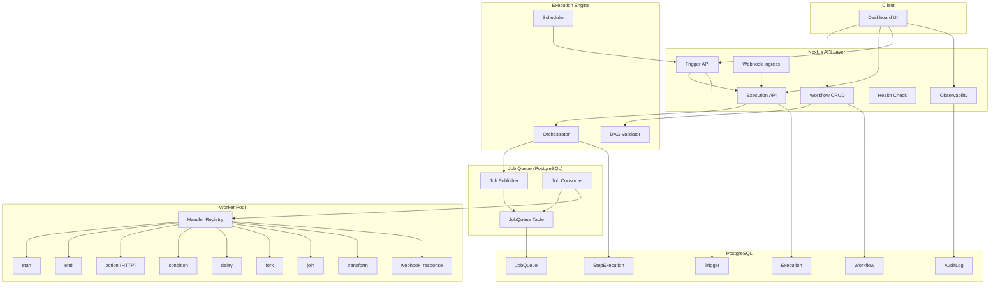
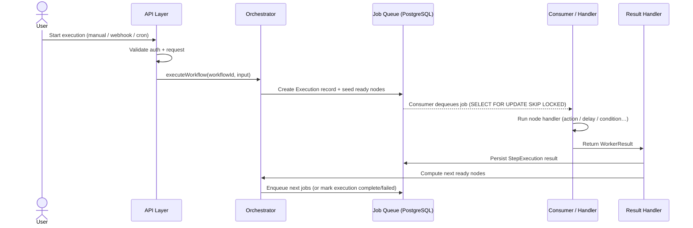
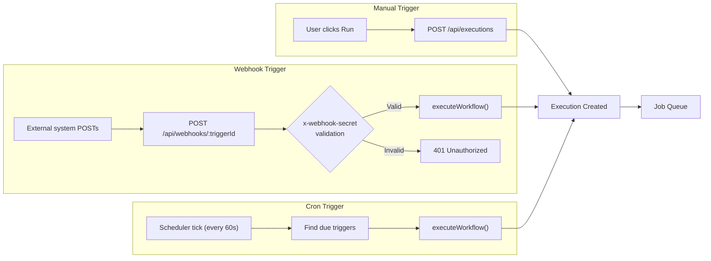
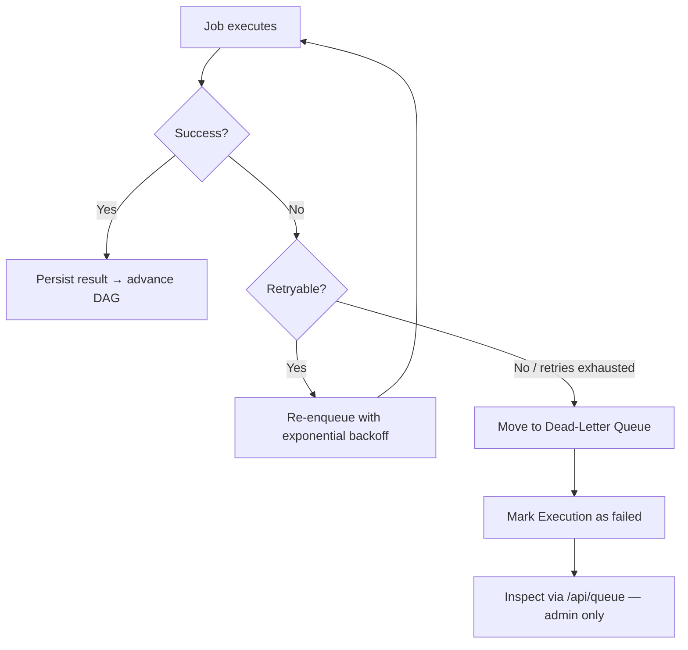

<div align="center">

# ⚡ FlowSync

**Durable workflow orchestration engine with event-driven execution and distributed workers.**

Built with Next.js · PostgreSQL · Prisma · Clerk Auth

</div>

---

## Why FlowSync?

Most internal tools eventually need some form of repeatable automation — calling APIs in a specific order, branching based on results, waiting between steps, running tasks in parallel, or recovering from failures. The usual approach is to hardcode that logic into a script or a single API endpoint, which becomes unmanageable fast.

FlowSync treats automation as a first-class concern. Users define workflows as Directed Acyclic Graphs (DAGs), activate them, and run them through a queue-backed execution engine that handles validation, state persistence, retries, failure isolation, and observability — all without requiring the developer to think about any of that per workflow.

The design goal was to build something that feels closer to AWS Step Functions or Temporal than to a simple task queue or a Zapier clone.

---

## Architecture


```mermaid
graph TD
    subgraph Client
        UI["Dashboard UI"]
    end

    subgraph API["Next.js API Layer"]
        WF["Workflow CRUD"]
        EX["Execution API"]
        TR["Trigger API"]
        WH["Webhook Ingress"]
        OBS["Observability"]
        HEALTH["Health Check"]
    end

    subgraph Engine["Execution Engine"]
        ORCH["Orchestrator"]
        SCH["Scheduler"]
        VAL["DAG Validator"]
    end

    subgraph Queue["Job Queue (PostgreSQL)"]
        PUB["Job Publisher"]
        JQ["JobQueue Table"]
        CON["Job Consumer"]
    end

    subgraph Workers["Worker Pool"]
        REG["Handler Registry"]
        START["start"]
        END_H["end"]
        ACT["action (HTTP)"]
        COND["condition"]
        DELAY["delay"]
        FORK["fork"]
        JOIN["join"]
        TRANS["transform"]
        WHRESP["webhook_response"]
    end

    subgraph Persistence["PostgreSQL"]
        DB_WF["Workflow"]
        DB_EX["Execution"]
        DB_STEP["StepExecution"]
        DB_TRIG["Trigger"]
        DB_JQ["JobQueue"]
        DB_AUDIT["AuditLog"]
    end

    UI --> WF & EX & TR & OBS
    WH --> EX
    WF --> VAL
    EX --> ORCH
    ORCH --> PUB
    PUB --> JQ
    CON --> JQ
    CON --> REG
    REG --> START & END_H & ACT & COND & DELAY & FORK & JOIN & TRANS & WHRESP
    SCH --> TR
    TR --> EX

    WF --> DB_WF
    EX --> DB_EX
    ORCH --> DB_STEP
    JQ --> DB_JQ
    OBS --> DB_AUDIT
    TR --> DB_TRIG
```

The system is split into five distinct layers: a **UI** for building and monitoring workflows, an **API layer** for all external interactions, an **orchestration engine** that controls graph traversal, a **queue and worker layer** that handles the actual execution, and **PostgreSQL** as the durable backing store for everything. Clerk provides authentication and user isolation across all layers.

---

## Execution Lifecycle

Every workflow run follows a deterministic sequence. Nothing executes in-memory during an API request — work is always persisted first, then processed asynchronously.


```mermaid
sequenceDiagram
    actor User
    participant API as API Layer
    participant Orch as Orchestrator
    participant Queue as Job Queue (PostgreSQL)
    participant Worker as Consumer / Handler
    participant Result as Result Handler

    User->>API: Start execution (manual / webhook / cron)
    API->>API: Validate auth + request
    API->>Orch: executeWorkflow(workflowId, input)
    Orch->>Queue: Create Execution record + seed ready nodes
    Queue-->>Worker: Consumer dequeues job (SELECT FOR UPDATE SKIP LOCKED)
    Worker->>Worker: Run node handler (action / delay / condition…)
    Worker->>Result: Return WorkerResult
    Result->>Queue: Persist StepExecution result
    Result->>Orch: Compute next ready nodes
    Orch->>Queue: Enqueue next jobs (or mark execution complete/failed)
```

The orchestrator and consumer are intentionally decoupled. The orchestrator decides **what** should run; the consumer **runs it**; the result handler **advances the graph**. This separation makes the flow easy to reason about and opens the door to horizontal scaling.

---

## Trigger Entry Points

Workflows can be started from three different entry points:


```mermaid
graph LR
    subgraph Manual["Manual Trigger"]
        M1["User clicks Run"] --> M2["POST /api/executions"]
    end

    subgraph Webhook["Webhook Trigger"]
        W1["External system POSTs"] --> W2["POST /api/webhooks/:triggerId"]
        W2 --> W3{"x-webhook-secret\nvalidation"}
        W3 -->|Valid| W4["executeWorkflow()"]
        W3 -->|Invalid| W5["401 Unauthorized"]
    end

    subgraph Cron["Cron Trigger"]
        C1["Scheduler tick (every 60s)"] --> C2["Find due triggers"]
        C2 --> C3["executeWorkflow()"]
    end

    M2 --> EX["Execution Created"]
    W4 --> EX
    C3 --> EX
    EX --> Q["Job Queue"]
```

---

## Failure Handling

When a job fails, it follows a controlled degradation path rather than silently dropping data:


```mermaid
graph TD
    A["Job executes"] --> B{Success?}
    B -->|Yes| C["Persist result → advance DAG"]
    B -->|No| D{Retryable?}
    D -->|Yes| E["Re-enqueue with exponential backoff"]
    E --> A
    D -->|No / retries exhausted| F["Move to Dead-Letter Queue"]
    F --> G["Mark Execution as failed"]
    G --> H["Inspect via /api/queue — admin only"]
```

Steps keep a count of `attempts`. Backoff is applied between retries to avoid hammering a failing downstream service. The DLQ preserves full error context — node label, type, error message, and failure timestamp — so operators can investigate without losing data.

---

## Features

| Category | Feature | Description |
|---|---|---|
| **Workflow Modeling** | DAG Definition | JSON-based directed acyclic graph definitions |
| | Visual Editor | Drag-and-drop workflow builder (ReactFlow) |
| | DAG Validation | Cycle detection, reachability analysis |
| | Versioning | Automatic version bumps on definition changes |
| **Execution** | Sequential Orchestration | Deterministic DAG traversal with state persistence |
| | Parallel Execution | Fork/join nodes for concurrent branches |
| | Conditional Branching | if/else routing based on previous step results |
| | Cancel Support | Graceful execution cancellation |
| **Triggers** | Manual | API-driven execution start |
| | Webhook | HTTP endpoint per trigger for external events |
| | Cron | Scheduled execution via cron expressions |
| **Reliability** | Retry Policy | Exponential backoff with configurable limits |
| | Idempotency | Deduplication keys prevent duplicate step execution |
| | Dead-Letter Queue | Captures permanently failed jobs for inspection |
| | Persistent Queue | PostgreSQL-backed queue with `SELECT FOR UPDATE SKIP LOCKED` |
| | Backpressure | Automatic queue throttling when depth exceeds limits |
| | Worker Heartbeat | Stall detection for unresponsive workers |
| **Observability** | Structured Logging | Categorized log levels with context |
| | Metrics | Execution counts, latency, queue throughput |
| | Audit Trail | Persistent event log for all system actions |
| | Execution Timeline | Step-by-step timing visualization |
| **Security** | Authentication | Clerk-based user auth with middleware |
| | User Isolation | Workflows/executions scoped to authenticated user |
| | Rate Limiting | Per-IP request throttling via trusted proxy detection |
| | Webhook Auth | Mandatory `x-webhook-secret` validation on ingress |
| | SSRF Protection | Hostname blocklist prevents internal network requests |
| | Tenant-Scoped Audit | Audit log queries restricted to caller's own entities |
| | Admin-Only Ops APIs | Queue, metrics, scheduler gated by `ADMIN_USER_ID` |
| | Security Headers | HSTS, X-Frame-Options, X-Content-Type-Options, Referrer-Policy |
| | Input Validation | Zod schemas on all mutation endpoints |
| | CORS Policy | Explicit origin allowlist via `ALLOWED_CORS_ORIGINS` |

---

## Node Types

| Type | Handler | Description |
|---|---|---|
| `start` | `StartHandler` | Entry point — every workflow begins here |
| `end` | `EndHandler` | Terminal node — marks execution complete |
| `action` | `ActionNodeHandler` | HTTP request (GET/POST/PUT/DELETE) to external APIs |
| `condition` | `ConditionHandler` | Evaluates expressions against previous step results for branching |
| `delay` | `DelayHandler` | Pauses execution for a configurable duration |
| `fork` | `ForkHandler` | Splits execution into parallel branches |
| `join` | `JoinHandler` | Waits for all parallel branches to complete before continuing |
| `transform` | `TransformHandler` | JSON field mapping, key renaming, and template strings |
| `webhook_response` | `WebhookResponseHandler` | Formats response data from previous step results |

---

## API Routes

| Method | Route | Description |
|---|---|---|
| `GET` | `/api/workflows` | List all workflows |
| `POST` | `/api/workflows` | Create a new workflow |
| `GET` | `/api/workflows/:id` | Get workflow details |
| `PUT` | `/api/workflows/:id` | Update workflow (auto-bumps version) |
| `DELETE` | `/api/workflows/:id` | Delete a workflow |
| `GET` | `/api/executions` | List all executions |
| `POST` | `/api/executions` | Start a new execution |
| `GET` | `/api/executions/:id` | Get execution details with steps |
| `POST` | `/api/executions/:id/cancel` | Cancel a running execution |
| `GET` | `/api/executions/:id/timeline` | Get execution timeline data |
| `GET` | `/api/triggers` | List all triggers |
| `POST` | `/api/triggers` | Create a trigger |
| `GET` | `/api/triggers/:id` | Get trigger details |
| `PUT` | `/api/triggers/:id` | Update trigger config |
| `DELETE` | `/api/triggers/:id` | Delete a trigger |
| `POST` | `/api/webhooks/:triggerId` | Webhook ingress (requires `x-webhook-secret` header) |
| `GET` | `/api/queue` | Queue monitoring stats (admin only) |
| `GET` | `/api/health` | Health probe (detailed stats require auth) |
| `GET` | `/api/scheduler/status` | Scheduler status (admin only) |
| `GET` | `/api/observability/metrics` | System metrics snapshot (admin only) |
| `GET` | `/api/observability/audit` | Query audit log (tenant-scoped) |

---

## Security

FlowSync implements defense-in-depth across the entire stack:

### Authentication & Authorization

- **Clerk middleware** protects all routes except `/`, `/sign-in`, `/sign-up`, `/api/webhooks`, and `/api/health`.
- **Webhook secret** — every webhook trigger generates a `webhookSecret` at creation time. The ingress endpoint **rejects** requests with a missing or incorrect `x-webhook-secret` header (HTTP 401). Responses are stripped to `{ executionId, status }` only.
- **Admin-only endpoints** — `/api/queue`, `/api/observability/metrics`, and `/api/scheduler/status` return **403 Forbidden** unless the caller's Clerk user ID matches `ADMIN_USER_ID`.
- **Tenant-scoped auditing** — `/api/observability/audit` filters results to the caller's own workflows, executions, triggers, and steps via Prisma `OR` joins.

### Network & Transport

- **Security headers** — `Strict-Transport-Security`, `X-Frame-Options: SAMEORIGIN`, `X-Content-Type-Options: nosniff`, `Referrer-Policy` applied globally.
- **CORS** — Explicitly configured via `ALLOWED_CORS_ORIGINS` env var. No wildcard origins.
- **Rate limiting** — Token bucket algorithm (60 request burst, 10 req/s refill) applied to every API route. IP extraction uses trusted proxy headers (`x-vercel-forwarded-for`, `cf-connecting-ip`, `fly-client-ip`) with fallback logic.

### Application

- **SSRF protection** — HTTP action nodes validate URLs against a blocklist: `localhost`, `127.0.0.1`, `[::1]`, `0.0.0.0`, `169.254.169.254`, `metadata.google.internal`, RFC 1918 ranges, `.internal`, and `.local` suffixes.
- **Input validation** — Zod schemas validate all POST/PUT request bodies before database operations.
- **SQL injection** — Prisma parameterizes all queries; no raw SQL with user input.
- **XSS** — React's default encoding prevents injection; no `dangerouslySetInnerHTML` usage.
- **Health endpoint** — Unauthenticated callers receive only `{ status, uptimeMs, timestamp }`. Full diagnostics (memory, queue depth, DLQ, backpressure) require a valid session.

---

## Tech Stack

| Layer | Technology |
|---|---|
| Framework | Next.js 16 (App Router) |
| Language | TypeScript |
| Database | PostgreSQL |
| ORM | Prisma 7 |
| Auth | Clerk |
| Visual Editor | @xyflow/react |
| Validation | Zod |
| Icons | Lucide React |
| Notifications | Sonner |

---

## Getting Started

### Prerequisites

- Node.js 18+
- PostgreSQL database (local or hosted)
- Clerk account for authentication

### Setup

```bash
# Clone the repository
git clone <repo-url>
cd flowey

# Install dependencies
npm install

# Set up environment variables
cp .env.example .env
# Edit .env with your values (see below)

# Push schema to database
npx prisma db push

# Generate Prisma client
npx prisma generate

# Start development server
npm run dev
```

### Environment Variables

| Variable | Description |
|---|---|
| `DATABASE_URL` | PostgreSQL connection string |
| `NEXT_PUBLIC_CLERK_PUBLISHABLE_KEY` | Clerk publishable key |
| `CLERK_SECRET_KEY` | Clerk secret key |
| `NEXT_PUBLIC_CLERK_SIGN_IN_URL` | Sign-in page path (default: `/sign-in`) |
| `NEXT_PUBLIC_CLERK_SIGN_UP_URL` | Sign-up page path (default: `/sign-up`) |
| `ADMIN_USER_ID` | Clerk user ID for admin-only endpoints (queue, metrics, scheduler) |
| `ALLOWED_CORS_ORIGINS` | Comma-separated list of allowed CORS origins for API routes |

---

## Project Structure

```
flowey/
├── app/
│   ├── api/                    # REST API routes
│   │   ├── executions/         # Execution management
│   │   ├── health/             # Health check endpoint
│   │   ├── observability/      # Metrics & audit routes
│   │   ├── queue/              # Queue monitoring
│   │   ├── scheduler/          # Scheduler status
│   │   ├── triggers/           # Trigger CRUD
│   │   ├── webhooks/           # Webhook ingress
│   │   └── workflows/          # Workflow CRUD
│   ├── components/             # React components
│   │   └── WorkflowEditor.tsx  # Visual DAG editor
│   ├── dashboard/              # Main dashboard page
│   ├── executions/             # Execution detail pages
│   ├── workflows/              # Workflow editor page
│   └── globals.css             # Design system
├── lib/
│   ├── queue/                  # Job queue subsystem
│   │   ├── job-queue.ts        # PostgreSQL-backed persistent queue
│   │   ├── job-consumer.ts     # Polling-based worker consumer
│   │   ├── job-publisher.ts    # Job enqueue logic
│   │   ├── result-handler.ts   # Result processing & DAG advancement
│   │   ├── dead-letter-queue.ts
│   │   ├── idempotency.ts
│   │   └── backpressure.ts
│   ├── workers/                # Worker subsystem
│   │   ├── handler-registry.ts # Node type → handler mapping
│   │   ├── worker-types.ts     # WorkerJob & WorkerResult types
│   │   ├── worker-heartbeat.ts # Stall detection
│   │   └── handlers/           # 9 node type handlers
│   ├── observability/          # Logging, metrics, audit
│   ├── scheduler/              # Cron scheduler
│   ├── middleware/              # Rate limiter
│   ├── orchestrator.ts         # DAG traversal engine
│   ├── dag-validator.ts        # Cycle detection & validation
│   ├── types.ts                # Shared TypeScript types
│   └── validations.ts          # Zod schemas
└── prisma/
    └── schema.prisma           # Database schema (6 models)
```

---

## Design Decisions & Known Limitations

The architecture prioritizes correctness and inspectability over raw throughput. A few deliberate tradeoffs worth noting:

- **PostgreSQL as queue** — Using `SELECT FOR UPDATE SKIP LOCKED` keeps the infrastructure footprint small and makes the queue state fully visible and queryable alongside the rest of the data. The tradeoff is that at very high job volumes, a dedicated broker like Redis or RabbitMQ would be more efficient.
- **Process-local scheduler** — The cron scheduler runs inside the Next.js process. This is fine for single-server deployments but would cause duplicate executions in a horizontally-scaled setup. A production-hardened version would use leader election or a dedicated scheduler worker.
- **In-memory DLQ and idempotency** — These are currently held in process memory, meaning they reset on server restart. Moving them to the database would add full durability.
- **Cron in the UI** — The backend scheduler fully supports cron triggers, but the UI currently exposes manual and webhook triggers more prominently. Aligning the UI to match the backend capabilities is a natural next step.

---

## License

MIT